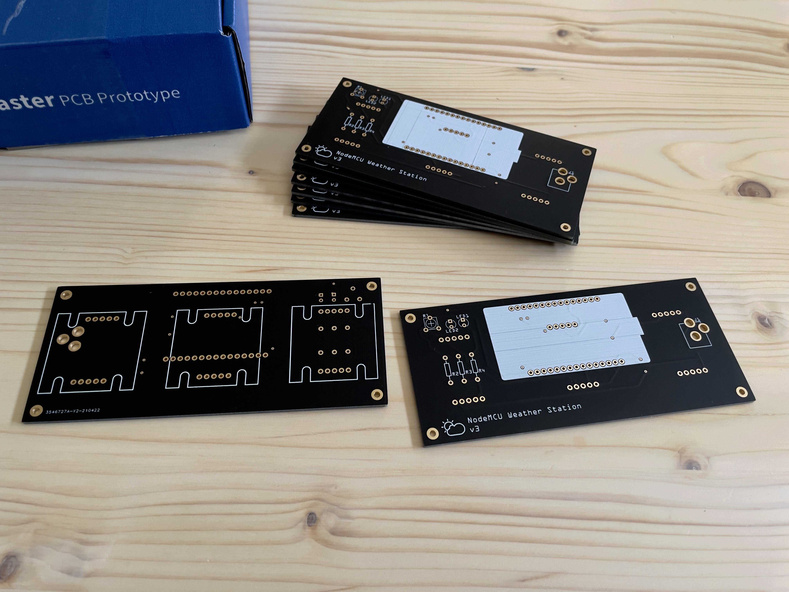
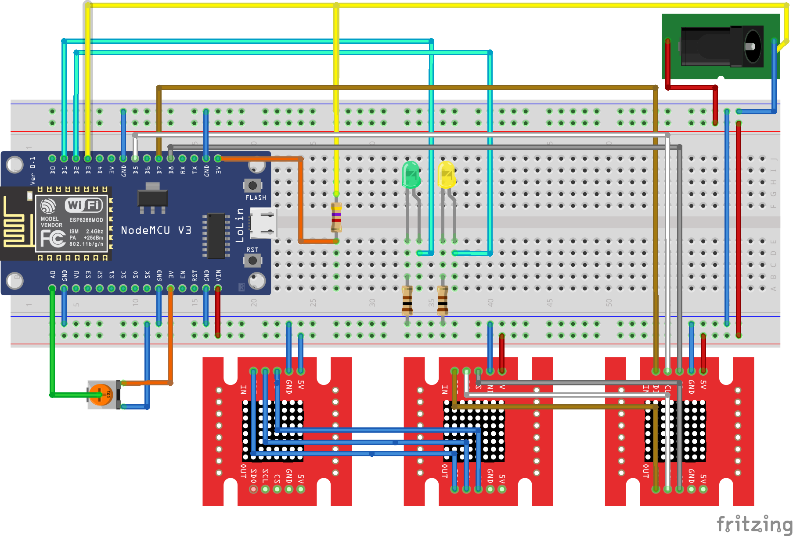
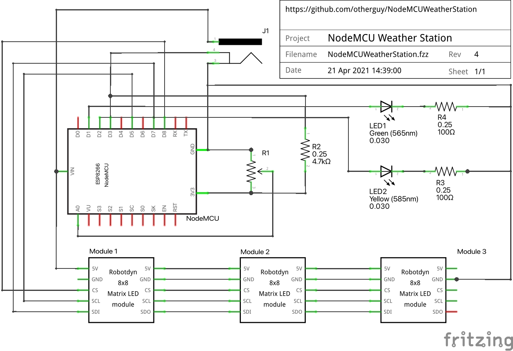
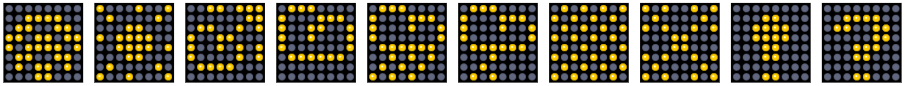

# 🌤 NodeMCU Weather Station

## Hardware BOM

The following components are required (all through hole):

| Qty. | Item                       | Value          | Label      | Footprint | Price    |
|----------|------------------------|----------------|------------|-----------|----------|
| 1    | ESP8266 NodeMCU board      | -              |            | -         | US$ 2.05 |
| 3    | MAX7219 8×8 SPI LED matrix | -              |            | -         | US$ 3.14 |
| 1    | DC Female Power Socket     | 5.5 × 2.1mm    | `J1`       | PTH       | US$ 0.07 |
| 1    | Trimmer potentiometer      | 3mm, 1kΩ       | `R1`       | DIP-3 PTH | US$ 0.04 |
| 1    | LED                        | green, 3mm     | `LED1`     | THT       | US$ 0.02 |
| 1    | LED                        | yellow, 3mm    | `LED2`     | THT       | US$ 0.02 |
| 1    | Resistor (axial)           | 4.7kΩ, ¼W, ±5% | `R2`       | THT       | US$ 0.01 |
| 2    | Resistor (axial)           | 100Ω, ¼W, ±5%  | `R3`, `R4` | THT       | US$ 0.01 |

I used [RobotDyn yellow/amber colored modules](https://www.aliexpress.com/item/32732745628.html). A lot
of other modules will also work, but they need to be 5-pin SPI chainable modules. Be aware of the pinout!

For the ESP8266 board, I used a [KeyeStudio NodeMCU](https://www.aliexpress.com/item/32668574859.html) but any
other NodeMCU V2 or V3 board also works.

The knockoff V3 boards are better because they use a CH340 USB controller chip and have the `A0` pin reference
voltage set at `3.3V` instead of `1.0V`, meaning no voltage divider circuit is needed.

## Circuit Board

The circuit board is very simple and just holds the NodeMCU and the 3 LED matrices as
well as the power jack and a trimpot to adjust the LED brightness.

I had 10 boards (1.6mm FR4 ENIG, RoHS, black solder mask) manufactured by [JLPCB](https://jlcpcb.com) for
US$ 44.00 including shipping in April 2021. The black solder mask makes it easy to prevent reflections inside
the case (and it looks gorgeous).

The [Fritzing file](hardware/NodeMCUWeatherStation.fzz) as well as the exported
[Gerber files](hardware/NodeMCUWeatherStation_Gerber.zip) can be found in the [hardware](hardware) folder.







The [`robotdyn-max7219-LED-matrix.fzpz`](hardware/robotdyn-max7219-LED-matrix.fzpz) Fritzing part was made
by [`@vanepp`](https://forum.fritzing.org/u/vanepp) on the Fritzing forums.

## Outer Case

[TBD]

## Prerequisites

Install [`esptool`](https://github.com/espressif/esptool) and [`ampy`](https://github.com/scientifichackers/ampy).

```bash
$ pip3 install --user esptool
$ pip3 install --user adafruit-ampy
```

## Install MicroPython

Download the latest [MicroPython firmware for ESP8266](https://micropython.org/download/esp8266/). I used
[`esp8266-20220117-v1.18.bin`](firmware/esp8266-20220117-v1.18.bin) and flash it to the NodeMCU.

_Note:_ The USB serial device (`/dev/tty.usbserial-1430`) will be different, depending on your operating
system, USB controller and port you use.

```bash
$ esptool.py --port /dev/tty.usbserial-1430 erase_flash
$ esptool.py --port /dev/tty.usbserial-1430 --baud 460800 write_flash --flash_size=detect -fm dio 0x00 firmware/esp8266-20220117-v1.18.bin
```

## Upload Software

Use [Adafruit's `ampy` tool](https://github.com/adafruit/ampy) to upload the software to the NodeMCU.

```bash
$ ampy --port /dev/tty.usbserial-1430 --baud 115200 put src/boot.py
$ ampy --port /dev/tty.usbserial-1430 --baud 115200 put src/secrets.py
$ ampy --port /dev/tty.usbserial-1430 --baud 115200 put src/symbols.py
$ ampy --port /dev/tty.usbserial-1430 --baud 115200 put src/max7219.py
$ ampy --port /dev/tty.usbserial-1430 --baud 115200 put src/main.py
```

## Weather Icons

The weather icons were custom designed using this excellent [LED Matrix Editor](https://git.io/J3N9M).


